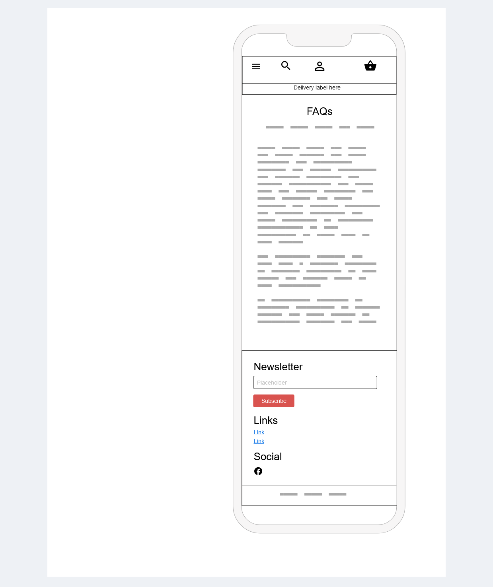
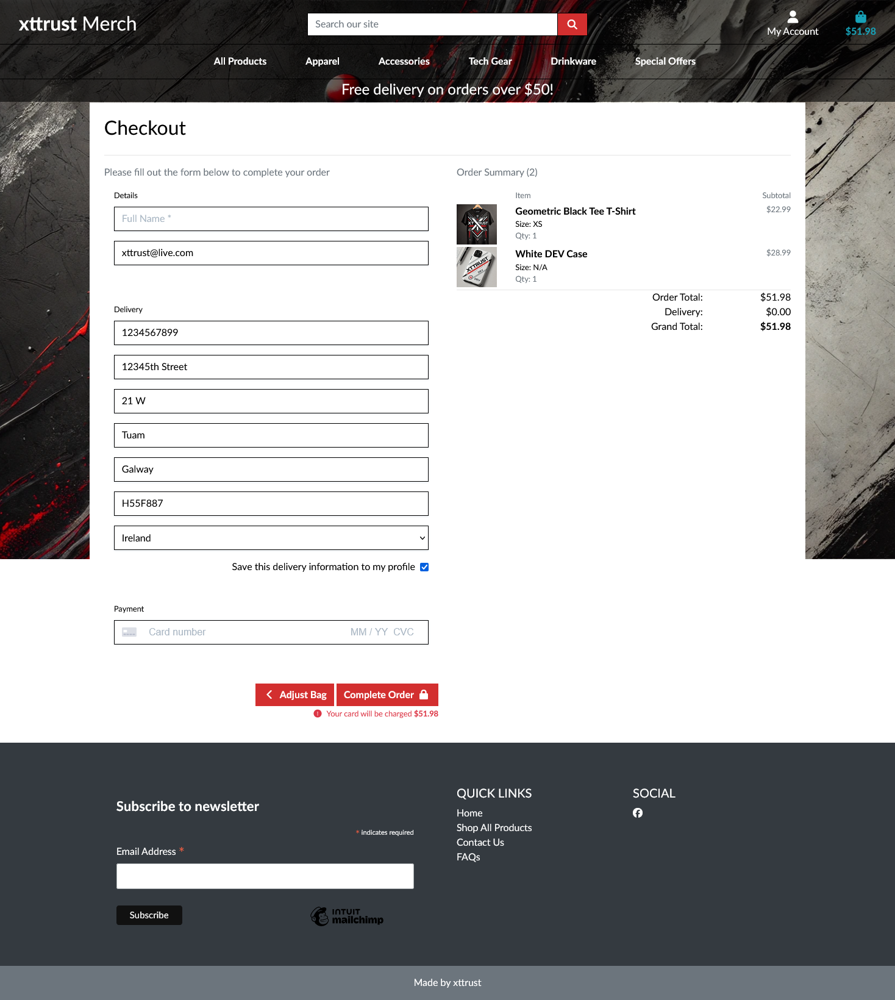

# xttrust Custom Merch - PP5
xttrust Custom Merch is an e-commerce platform built using Django, designed to provide a seamless online shopping experience. The platform allows users to browse a wide range of xttrust-branded products including apparel, accessories, tech gear, and drinkware. Users can view product details, manage their shopping cart, proceed through a secure checkout process, manage their profiles, and create wishlists for future purchases. The site is built with a responsive design, ensuring an optimized experience across both desktop and mobile devices.

Explore the live application at [xttrust Custom Merch Deployed Site](https://xttrust-custom-merch-bcda5a9b1581.herokuapp.com/).


# Business Model

**Xttrust Merch** operates as a **B2C (Business-to-Consumer)** e-commerce platform, focusing on providing high-quality merchandise directly to consumers. The platform offers a range of products, including apparel, accessories, and tech gear. The business model is built around online retail, and it leverages several core components to maximize customer engagement, sales, and growth.

## Revenue Streams

1. **Direct Product Sales**:
   - The primary revenue source is direct sales of products through the online store.
   - Customers can browse and purchase a variety of products, including limited-edition collections, which are promoted to increase urgency and exclusivity.

2. **Loyalty and Discount Programs**:
   - Repeat customers are incentivized through loyalty discounts, coupon codes, and exclusive offers.
   - Special deals for newsletter subscribers or account holders encourage registration and build a loyal customer base.

## Marketing Strategies

1. **SEO and Content Marketing**:
   - The platform is optimized for search engines (SEO) to drive organic traffic.

2. **Email Marketing and Newsletters**:
   - The site integrates a newsletter feature where users can subscribe for updates, exclusive discounts, and product launches.
   - Email campaigns are sent to customers and subscribers to drive repeat purchases and promote new collections, using Mailchimp

3. **Social Media Integration**:
   - The platform actively engages with customers through social media channels like , Facebook. [Visit our Facebook Page](https://www.facebook.com/profile.php?id=61567694603658)
   - Social media is used to showcase products, share customer stories, and run ad campaigns that drive traffic back to the site.

## Operational Model

1. **Product Management**:
   - The admin team manages product listings, inventory, and pricing directly through the platform’s admin dashboard.
   - Inventory management ensures the store is updated in real-time to reflect stock availability, maintaining transparency with customers.

2. **Customer Support**:
   - A dedicated FAQ section and contact form are provided for customer inquiries, ensuring timely support.
   - The platform also offers features for customers to track their orders and manage their account details.

3. **Secure Payments**:
   - The platform supports secure payment gateways, such as Stripe, ensuring customers can shop with confidence.
   - All transactions are encrypted, and customer data is securely stored, adhering to compliance and security standards.

4. **Delivery and Fulfillment**:
   - Orders are processed and shipped efficiently, with delivery cost calculations based on order size and location.
   - Customers are notified of their order status with tracking information to enhance the shopping experience.

## Scalability and Growth Potential

- The platform is designed to scale, with the ability to add new product categories, expand marketing campaigns, and integrate additional third-party services like CRM tools or advanced analytics.
- Future growth opportunities include expanding the customer base through international shipping options, affiliate programs, and partnerships with influencers.


# Site Goals

## 1. Provide an Engaging and User-Friendly Shopping Experience
   - Ensure that users can easily navigate the site and find products through a user-friendly interface.
   - Offer product sorting, filtering, and search functionalities to help customers quickly locate what they are interested in.
   - Provide detailed product information, including images, descriptions, and reviews, to aid customers in making informed purchasing decisions.

## 2. Enable Seamless and Secure Transactions
   - Allow customers to add products to their shopping cart and manage their cart contents efficiently.
   - Provide a secure and smooth checkout process that supports multiple payment methods (e.g., Stripe) to instill trust and confidence in users.
   - Offer order confirmation and summary pages to ensure customers are fully informed about their purchases.

## 3. Promote Customer Retention Through Accounts and Personalized Experiences
   - Allow users to create and manage accounts to view order history, manage wishlists, and store shipping details for quicker future purchases.
   - Offer personalized experiences such as wishlists and profile management to enhance user engagement and loyalty.

## 4. Maintain a Dynamic and Updated Product Catalog
   - Ensure that admins have the ability to add, edit, and delete products efficiently through a user-friendly admin interface.
   - Keep the product catalog organized with proper categories and relevant information, ensuring customers can find new and existing products effortlessly.

## 5. Enhance Visibility and Traffic Through Marketing and SEO
   - Integrate SEO features such as meta titles, descriptions, and keywords for all products and pages to optimize search engine visibility.
   - Incorporate social media links and an email subscription feature to build an audience and engage users beyond the site.
   - Enable admin users to manage newsletter subscriptions and marketing campaigns through integration with platforms like Mailchimp.

## 6. Provide Effective Support and Communication Channels
   - Offer a comprehensive FAQ section to help users find answers to common questions and issues.
   - Provide a contact form so users can easily reach out for support or inquiries, ensuring responsive customer service.
   - Allow admins to manage the FAQ and contact responses to maintain accurate and up-to-date support information.

## 7. Foster Trust and Credibility Through Reviews and Feedback
   - Allow customers to leave product reviews and ratings, enabling others to make more informed buying decisions.
   - Moderate and manage reviews to maintain the quality of content and ensure it aligns with site standards.
   - Display customer feedback prominently to build trust and credibility with prospective customers.

## 8. Ensure Responsiveness and Accessibility Across All Devices
   - Develop the site using responsive design principles so that it functions seamlessly across desktop, tablet, and mobile devices.
   - Incorporate accessibility best practices to ensure the site is usable for all users, including those who rely on assistive technology.

## 9. Maintain Robust Error Handling and User-Friendly Feedback
   - Provide clear and informative error messages to guide users when they encounter issues, enhancing the overall user experience.
   - Develop custom error pages (e.g., 404 page) that redirect users back to relevant parts of the site, preventing frustration and encouraging continued navigation.

## 10. Streamline Admin Management and Operations
   - Allow admins to view and manage customer orders efficiently, ensuring prompt fulfillment and delivery.
   - Provide tools for managing user accounts and roles, ensuring site security and the ability to control access.
   - Offer easy-to-use interfaces for adding and updating SEO metadata, managing newsletters, and controlling product inventory.

# User Experience
## User Stories

## Epic 1: Browsing and Viewing Products [#1](https://github.com/xttrust/xttrust-custom-merch/issues/1)
- **User Story 1.1**: As a customer, I want to browse products by category, so I can easily find items that interest me. [#2](https://github.com/xttrust/xttrust-custom-merch/issues/2)
- **User Story 1.2**: As a customer, I want to view detailed information about each product, so I can decide if I want to buy it. [#3](https://github.com/xttrust/xttrust-custom-merch/issues/3)

## Epic 2: Shopping Cart and Checkout [#4](https://github.com/xttrust/xttrust-custom-merch/issues/4)
- **User Story 2.1**: As a customer, I want to add products to a shopping cart, so I can review my selections before making a purchase. [#5](https://github.com/xttrust/xttrust-custom-merch/issues/5)
- **User Story 2.2**: As a customer, I want to securely pay for the items in my cart, so I can complete my purchase.  [#6](https://github.com/xttrust/xttrust-custom-merch/issues/6)


## Epic 3: User Accounts and Profiles [#7](https://github.com/xttrust/xttrust-custom-merch/issues/7)
- **User Story 3.1**: As a customer, I want to create an account so that I can view my past orders and manage my personal information.  [#8](https://github.com/xttrust/xttrust-custom-merch/issues/8)
- **User Story 3.2**:As a customer, I want to log in and out of my account securely, so I can access my profile and keep my data safe. [#9](https://github.com/xttrust/xttrust-custom-merch/issues/9)

## Epic 4: Admin Management [#10](https://github.com/xttrust/xttrust-custom-merch/issues/10)
- **User Story 4.1**: As an admin, I want to add, edit, and delete products, so I can manage the store’s product catalog. [#11](https://github.com/xttrust/xttrust-custom-merch/issues/11)
- **User Story 4.2**: As an admin, I want to view and manage customer orders, so I can fulfill orders and track inventory. [#12](https://github.com/xttrust/xttrust-custom-merch/issues/12)

## Epic 5: Marketing and SEO [#13](https://github.com/xttrust/xttrust-custom-merch/issues/13)
- **User Story 5.1**: As a site owner, I want to improve SEO, so I can attract more visitors through search engines. [#14](https://github.com/xttrust/xttrust-custom-merch/issues/14)
- **User Story 5.2**: As a site owner, I want to integrate social media links and a newsletter signup, so I can grow my audience. [#15](https://github.com/xttrust/xttrust-custom-merch/issues/15)

## Epic 6:  Wishlist [#16](https://github.com/xttrust/xttrust-custom-merch/issues/16)
- **User Story 6.1**: As a user, I want to view all the items in my wishlist, So that I can easily see the products I am interested in and consider purchasing them later. [#17](https://github.com/xttrust/xttrust-custom-merch/issues/17)
- **User Story 6.2**: As a user, I want to add products to my Wishlist, So that I can save items I am interested in for future purchases. [#18](https://github.com/xttrust/xttrust-custom-merch/issues/18)
- **User Story 6.3**: As a user, I want to remove products from my wishlist, So that I can manage and keep my wishlist up to date with only the items I want to save. [#19](https://github.com/xttrust/xttrust-custom-merch/issues/19)
## Epic 7:  Product Reviews [#20](https://github.com/xttrust/xttrust-custom-merch/issues/20)
- **User Story 7.1 - Add a Product Review**:  As a user, I want to add a review for a product I purchased, so that I can share my feedback and help others make informed decisions. [#21](https://github.com/xttrust/xttrust-custom-merch/issues/21)
- **User Story 7.2 -  View Product Reviews**: As a user, I want to view all reviews for a product, so that I can read feedback from other customers before making a purchase. [#22](https://github.com/xttrust/xttrust-custom-merch/issues/22)
- **User Story 7.3 - Delete a Review**: As a user, I want to delete my review for a product, so that I can remove feedback I no longer want displayed. [#23](https://github.com/xttrust/xttrust-custom-merch/issues/23)
- **User Story 7.4 - Prevent Multiple Reviews**: As a user, I want to be prevented from submitting more than one review for the same product, so that I only provide feedback once. [#24](https://github.com/xttrust/xttrust-custom-merch/issues/24)
- **User Story 7.5 - Display Star Ratings**: As a user, I want to see star ratings displayed visually for each review, so that I can quickly understand the feedback. [#25](https://github.com/xttrust/xttrust-custom-merch/issues/25)

# UI
## Design

The base design of the website was inspired by the Code Institute's Boutique Ado walkthrough project. This provided a solid foundation for building an e-commerce platform with a focus on usability and clean aesthetics. However, several additional styling changes were implemented to enhance the user experience (UX) and user interface (UI). These changes aim to provide a unique and engaging shopping experience, ensuring the website is both visually appealing and easy to navigate.

### Key Design Features:
- **Consistent Branding**: The design maintains a consistent theme throughout, with a cohesive color scheme and typography.
- **Responsive Design**: The site is fully responsive, ensuring it looks great and functions well on all device sizes, from desktops to mobile devices.
- **Interactive Elements**: Hover animations and button effects were added to create a dynamic and engaging experience for users.
- **Enhanced Product Display**: Product cards were styled with shadows and animations to highlight products as users browse.
- **User-Friendly Navigation**: Navigation menus were designed to be intuitive, allowing users to easily find products, view their shopping bag, and access account features.

These enhancements were made to not only differentiate the design but also to provide users with a seamless and enjoyable shopping experience.

## Color Scheme

The color scheme for **Xttrust Merch** is designed to reflect a modern, clean, and professional aesthetic while maintaining a dynamic and engaging user experience. The palette is balanced between primary and accent colors to ensure brand consistency across the site.

## Primary Colors
- **Primary Red (#FF4C4C)**: Used for call-to-action buttons, highlights, and accents to draw attention to important elements.
- **Deep Black (#1D1D1D)**: Backgrounds and primary text color to maintain a clean, bold look and ensure readability.

## Secondary Colors
- **Light Gray (#F5F5F5)**: Used for background shades and subtle contrasts to maintain a neutral backdrop.
- **White (#FFFFFF)**: Applied for background sections, card backgrounds, and text for a clean, minimalistic look.

## Accent Colors
- **Blue Accent (#007BFF)**: Used for links, hover states, and buttons to provide a sense of action and engagement.
- **Yellow Highlight (#FFD700)**: Highlighting sales, discounts, and promotional content to attract attention.

## Sample Usage
- Buttons and CTA: **Primary Red**
- Backgrounds: **Deep Black**, **Light Gray**
- Text: **White**, **Deep Black**
- Links and Highlights: **Blue Accent**, **Yellow Highlight**

# Models

The following are the key models used in **Xttrust Merch**, outlining the relationships and fields that define the structure of the application.

## 1. Product
- **Fields**: `id`, `sku`, `name`, `description`, `category`, `price`, `rating`, `image_url`, `image`, `has_sizes`
- **Description**: Represents individual products available in the store. Products can belong to a category, have multiple sizes, and include pricing and rating details.

## 2. Category
- **Fields**: `id`, `name`, `friendly_name`
- **Description**: Represents product categories that help organize the products. Each category includes a friendly name for display purposes.

## 3. Order
- **Fields**: `order_number`, `user_profile`, `full_name`, `email`, `phone_number`, `country`, `postcode`, `town_or_city`, `street_address1`, `street_address2`, `county`, `date`, `delivery_cost`, `order_total`, `grand_total`, `original_bag`, `stripe_pid`
- **Description**: Stores information related to a customer's order, including their details, delivery costs, and payment information.

## 4. OrderLineItem
- **Fields**: `order`, `product`, `product_size`, `quantity`, `lineitem_total`
- **Description**: Represents individual items within an order. Linked to the order and product models, it records quantity, size, and line item totals.

## 5. UserProfile
- **Fields**: `user`, `default_phone_number`, `default_street_address1`, `default_street_address2`, `default_town_or_city`, `default_county`, `default_postcode`, `default_country`
- **Description**: A profile model that stores default delivery information and order history for each user.

## 6. Wishlist
- **Fields**: `user`, `products`
- **Description**: Stores products that a user has added to their wishlist, allowing them to save products for later.

## 7. Review
- **Fields**: `user`, `product`, `rating`, `body`, `created_at`
- **Description**: Manages product reviews submitted by users. Each review includes a rating, written feedback, and timestamp.

## 8. FAQ
- **Fields**: `question`, `answer`
- **Description**: Stores frequently asked questions for the support section of the site, enhancing user support.

## 9. Contact
- **Fields**: `user`, `subject`, `message`, `created_at`
- **Description**: Captures contact messages submitted through the contact form, storing details for site admins to respond to.

## Model Relationships
- **Product - Category**: Each product belongs to a category.
- **Order - UserProfile**: Each order is associated with a user profile.
- **Order - OrderLineItem**: An order can have multiple line items.
- **User - UserProfile**: Each user has a one-to-one relationship with their profile.
- **Wishlist - Product**: Users can have multiple products in their wishlist.
- **Review - Product**: Reviews are tied to specific products.

This structured approach ensures that data is managed efficiently, providing a scalable and maintainable e-commerce platform.
### Database Diagram  


# Fonts

To ensure a clean and modern typography, I use Google Fonts. This provides a selection of high-quality, web-safe fonts that are both easy to read and visually appealing.

- **Montserrat**: A sans-serif font with a modern and bold appearance, ideal for headings and emphasis.
  - [Montserrat Google Font](https://fonts.googleapis.com/css2?family=Montserrat:wght@400;700&display=swap)

- **Roboto**: A versatile and easy-to-read sans-serif font used for body text and paragraphs.
  - [Roboto Google Font](https://fonts.googleapis.com/css2?family=Roboto:wght@300;400&display=swap)

These fonts are chosen for their readability and compatibility, ensuring a consistent and professional look across the website.

# Wireframes
## Desktop

<details><summary>Home</summary>

</details>

<details><summary>404 Page</summary>

</details>

<details><summary>Bag</summary>

</details>

<details><summary>Checkout</summary>

</details>

<details><summary>Contact</summary>

</details>

<details><summary>FAQs</summary>

</details>

<details><summary>Product Management</summary>

</details>

<details><summary>Products</summary>

</details>

<details><summary>Profile</summary>

</details>

<details><summary>View Product</summary>

</details>

<details><summary>Wishlist</summary>

</details>

---

## Mobile

<details><summary>Home</summary>

</details>

<details><summary>404 Page</summary>

</details>

<details><summary>Bag</summary>

</details>

<details><summary>Checkout</summary>

</details>

<details><summary>Contact</summary>

</details>

<details><summary>FAQs</summary>

</details>

<details><summary>Product Management</summary>

</details>

<details><summary>Products</summary>

</details>

<details><summary>Profile</summary>

</details>

<details><summary>View Product</summary>

</details>

<details><summary>Wishlist</summary>

</details>

### Agile Methodology

In my project, **xttrust Custom Merch**, I use Agile methodology to manage the development process efficiently. Here's how it is structured:

1. **Work in Short Cycles (Sprints)**
   - The project is divided into small, manageable sprints, each lasting between two days and one week. At the end of each sprint, the work is reviewed, and the next steps are planned.

2. **Define What to Build (User Stories)**
   - User stories are written to describe each feature or improvement needed. These stories outline tasks from the user’s perspective, clarifying the goals for each sprint.

3. **Daily Check-ins**
   - Quick daily updates are done to track progress, identify any issues, and stay focused on the goals of the current sprint.

4. **Plan the Sprint**
   - At the beginning of each sprint, I plan the user stories or tasks to be worked on, setting clear objectives and managing time effectively.

5. **Review and Get Feedback**
   - At the end of each sprint, the completed work is reviewed and feedback is gathered. This helps ensure the project stays on track and aligns with the desired goals.

6. **Reflect and Improve**
   - After each sprint, I reflect on the successes and areas for improvement. This retrospective helps me refine my approach for the next sprint.

7. **Stay Flexible**
   - I remain open to changes, adapting the plan as needed based on feedback or new requirements. This flexibility allows me to respond quickly to changes or challenges.

By using Agile methodology, the project is managed with regular progress checks, continuous improvement, and adjustments based on feedback. This approach ensures the project evolves efficiently and meets the defined objectives.

#### GitHub Projects/Board

The project uses a GitHub Project Board for task management, structured with columns such as Todo, In Progress, and Done. This setup provides an organized way to visualize and manage workflow, ensuring tasks are tracked consistently throughout development. The board is linked to the repository for easy access.

<details><summary>View GitHub Board</summary>

</details>


## Features

### Navigation Header

The navigation header is consistent across all pages and designed to be fully responsive. It features:

- **Left Side**: The website name, "xttrust Merch."
- **Middle**: The main menu includes categories such as "Apparel," "Accessories," "Tech Gear," "Drinkware," and "Special Offers" for easy navigation.
- **Right Side**: Shows icons for user authentication status and shopping bag contents:
  - **Authenticated Users**: See options like "My Profile," "Wishlist," and "FAQs."
  - **Unauthenticated Users**: See options like "Login" and "Register."

On mobile, the navbar collapses into a hamburger menu icon. Clicking it reveals a dropdown menu with all available navigation links.

<details><summary>Desktop Navbar (Open)</summary>

</details>

<details><summary>Mobile Navbar (Closed)</summary>

</details>

<details><summary>Mobile Navbar (Open)</summary>

</details>

<details><summary>Mobile Navbar (My Account)</summary>

</details>

<details><summary>Mobile Navbar (Search)</summary>

</details>

### Hero Section

The hero section grabs attention with bold graphics, featuring promotional messages and a call-to-action ("Shop Now") button. The background design complements the overall theme of the site and visually engages users.

<details><summary>Hero Desktop</summary>

</details>

<details><summary>Hero Mobile</summary>

</details>

### Product Listings

The product listing pages showcase the available merchandise in a grid format, with product images, prices, and ratings prominently displayed. Users can navigate through products easily using pagination controls.

<details><summary>Product Listings Desktop</summary>

</details>

<details><summary>Product Listings Mobile</summary>

</details>

### Product Detail Page

Each product detail page includes a detailed view of the selected item, complete with images, price, size selection options, quantity controls, and a description. Authenticated users have options to edit or delete the product if they have permissions.

<details><summary>Product Detail Desktop</summary>

</details>

<details><summary>Product Detail Mobile</summary>

</details>

### Product Reviews

Users can view and add reviews for products. The review section shows the current rating and user feedback. Authenticated users can delete their reviews if needed.

<details><summary>Product Reviews Desktop</summary>

</details>

<details><summary>Product Reviews Mobile</summary>

</details>

### Wishlist

Authenticated users can add products to their wishlist for future reference. The wishlist page allows users to manage saved products, offering options to view product details or remove items.

<details><summary>Wishlist Desktop</summary>

</details>

<details><summary>Wishlist Mobile</summary>

</details>

### Shopping Bag

The shopping bag page displays products added by users, including their quantity and subtotal for each item. It shows a summary of the total cost and offers options to update the cart or proceed to checkout.

<details><summary>Bag Empty (Desktop)</summary>

</details>

<details><summary>Bag Empty (Mobile)</summary>

</details>

<details><summary>Bag Not Empty (Desktop)</summary>

</details>

<details><summary>Bag Not Empty (Mobile)</summary>

</details>

### Checkout

The checkout page guides users through the process of entering their delivery and payment information. It includes form validation and options to save delivery details to user profiles for convenience.

<details><summary>Checkout Desktop</summary>

</details>

<details><summary>Checkout Mobile</summary>

</details>

### Sign In and Sign Out

- The **Sign In** page allows users to access their accounts. It includes options for password recovery.
- The **Sign Out** page confirms the user's decision to log out.

<details><summary>Sign In Desktop</summary>

</details>

<details><summary>Sign In Mobile</summary>

</details>

<details><summary>Sign Out Desktop</summary>

</details>

<details><summary>Sign Out Mobile</summary>

</details>

### Registration

The registration page allows new users to create an account. It includes validation for email format, password strength, and confirmation fields.

<details><summary>Registration Desktop</summary>

</details>

<details><summary>Registration Mobile</summary>

</details>

### Password Reset

The password reset page enables users to recover access to their account via email if they have forgotten their password.

<details><summary>Password Reset Desktop</summary>

</details>

<details><summary>Password Reset Mobile</summary>

</details>

### Newsletter Subscription

Users can subscribe to the newsletter through a form located in the footer. Successful subscription confirmation is displayed upon submission.

<details><summary>Newsletter Subscription</summary>

</details>

<details><summary>Newsletter Success</summary>

</details>

### Contact Us

The contact page provides a form for users to send inquiries. It validates the input and ensures all required fields are completed before submission.

<details><summary>Contact Us Desktop</summary>

</details>

<details><summary>Contact Us Mobile</summary>

</details>

### FAQs

The FAQs page lists frequently asked questions in an accordion format, making it easy for users to find and expand the answers they are interested in.

<details><summary>FAQs Desktop</summary>

</details>

<details><summary>FAQs Mobile</summary>

</details>

### Footer

The footer provides easy navigation and access to important links and social media channels.

- **Left Side**: A subscription form for users to sign up for the newsletter.
- **Center**: Quick links such as "Home," "Shop All Products," "Contact Us," and "FAQs."
- **Right Side**: Social media icons linked to relevant platforms.

<details><summary>Footer Desktop</summary>

</details>

<details><summary>Footer Mobile</summary>

</details>


## Technologies

### Technologies Used

- [Bootstrap 5](https://getbootstrap.com/) was used to create a responsive and modern structure for the website.
- [jQuery](https://jquery.com/) was utilized for simplified DOM manipulation and event handling.
- [Django](https://www.djangoproject.com/) is the web framework used for developing the backend and serving dynamic content.
- [PostgreSQL](https://www.postgresql.org/) is the database used to manage and store data securely.
- [Cloudinary](https://pypi.org/project/cloudinary/1.27.0/) was used for storing, optimizing, transforming, and delivering images, videos, and other media assets.
- [Stripe API](https://stripe.com/) was integrated for secure payment processing in the e-commerce functionality.
- [GitHub](https://github.com/) was used for version control and hosting the source code.
- [GitPod](https://gitpod.io/) was utilized as the development environment for coding and testing.
- [Heroku](https://www.heroku.com/) is the platform used for deploying the live application.
- [Gunicorn](https://gunicorn.org/) was used as the WSGI HTTP server for running the Django application in production.
- [Font Awesome](https://fontawesome.com/) was used for the icons displayed across the website.
- [Google Fonts](https://fonts.google.com/) was used to style the typography of the website.
- [Favicon Generator](https://favicon.io/) was used to create the favicon for the website.
- [Google Chrome Lighthouse](https://developers.google.com/web/tools/lighthouse) was used for performance, accessibility, and SEO testing.
- [Google Chrome Developer Tools](https://developer.chrome.com/docs/devtools/) was used for debugging and optimizing responsiveness.
- [W3C HTML Validator](https://validator.w3.org/) was used to validate HTML code for errors.
- [W3C CSS Validator](https://jigsaw.w3.org/css-validator/) was used to validate CSS for compliance with best practices.
- [CI Python Pep8 Checker](https://pep8ci.herokuapp.com/) was used to ensure the Python code follows the PEP8 style guide.
- [xml-sitemaps.com](https://www.xml-sitemaps.com/) was used to create all links in sitemap.

### Languages Used

- **HTML5** (HyperText Markup Language)
- **CSS3** (Cascading Style Sheets)
- **JavaScript**
- **Python**
- **SQL** (Structured Query Language)
- **Django Template Language**

### Python Modules Imported

### Python Modules Imported

- [asgiref](https://pypi.org/project/asgiref/) (3.8.1): ASGI (Asynchronous Server Gateway Interface) is a specification for Python web servers and applications, used for handling asynchronous web requests in Django.
- [boto3](https://pypi.org/project/boto3/) (1.35.44): The Amazon Web Services (AWS) SDK for Python, used for integrating and managing AWS services like S3 for file storage.
- [botocore](https://pypi.org/project/botocore/) (1.35.44): A low-level interface for interacting with AWS services, utilized by `boto3` to provide APIs and services.
- [cloudinary](https://pypi.org/project/cloudinary/) (1.41.0): Cloudinary Python SDK, used for managing and optimizing image and video uploads.
- [crispy-bootstrap4](https://pypi.org/project/crispy-bootstrap4/) (2024.10): A Django application that simplifies styling forms with Bootstrap 4.
- [dj-database-url](https://pypi.org/project/dj-database-url/) (0.5.0): Simplifies configuring database URLs in Django projects, especially in deployment environments like Heroku.
- [Django](https://pypi.org/project/Django/) (5.1.2): The high-level Python web framework used for building and managing the backend of the application.
- [django-allauth](https://pypi.org/project/django-allauth/) (65.0.2): An integrated set of Django applications for handling authentication, including registration, login, logout, and social account integration.
- [django-cloudinary-storage](https://pypi.org/project/django-cloudinary-storage/) (0.3.0): A storage backend for integrating Cloudinary with Django to manage and serve media files.
- [django-countries](https://pypi.org/project/django-countries/) (7.6.1): Provides country choices for Django models, forms, and fields.
- [django-crispy-forms](https://pypi.org/project/django-crispy-forms/) (2.3): Enhances Django forms with more styling and layout options, using Bootstrap.
- [django-storages](https://pypi.org/project/django-storages/) (1.14.4): A Django package that provides storage backends, used with AWS S3 for managing static and media files.
- [gunicorn](https://pypi.org/project/gunicorn/) (23.0.0): A Python WSGI HTTP server for deploying the Django application in a production environment.
- [jmespath](https://pypi.org/project/jmespath/) (1.0.1): A library for parsing and transforming JSON, used by `boto3` for AWS API responses.
- [pillow](https://pypi.org/project/Pillow/) (11.0.0): Python Imaging Library (PIL) fork used for handling image files in Django applications.
- [psycopg2](https://pypi.org/project/psycopg2/) (2.9.10): PostgreSQL adapter for Python, enabling Django to interact with PostgreSQL databases.
- [s3transfer](https://pypi.org/project/s3transfer/) (0.10.3): Used by `boto3` for efficient and reliable transfers to and from AWS S3.
- [sqlparse](https://pypi.org/project/sqlparse/) (0.5.1): A non-validating SQL parser for Python, used by Django for SQL statement handling.
- [stripe](https://pypi.org/project/stripe/) (11.1.0): Stripe's official Python library, integrated for secure payment processing.
- [whitenoise](https://pypi.org/project/whitenoise/) (6.7.0): A package that simplifies serving static files directly from the web server, improving application performance.


## Testing

For a comprehensive overview of the testing process, please refer to [TESTING.md](./TESTING.md). 

The testing documentation includes detailed explanations of all the tests conducted, covering various scenarios, edge cases, and results to ensure the robustness and reliability of the application.

## Bugs

### Unfixed Bugs
- HTML li and duplicate id

## Deployment

### Pre-Deployment Checklist

To ensure a smooth deployment of the application on Heroku, follow these steps:

To ensure a smooth deployment of the application on Heroku, follow these steps:

1. **Update `requirements.txt`:**
   - Keep the `requirements.txt` file current to ensure all necessary Python modules are included and correctly configured. This file lists all the dependencies your project needs to run.

2. **Create a `Procfile`:**
   - A `Procfile` is essential for Heroku deployment. It should be set up to configure a Gunicorn web server for your application. An example entry in the `Procfile` might look like:
     ```
     web: gunicorn app_name.wsgi
     ```

3. **Configure `settings.py`:**
   - In `settings.py`, update the `ALLOWED_HOSTS and CSRF_TRUSTED_ORIGINS` list with your Heroku app's domain and `localhost`. For example:
     ```python
     ALLOWED_HOSTS = ['.herokuapp.com', 'localhost']
     ```
   - Ensure that all static files and directories are properly configured.

4. **Set Environment Variables:**
   - Configure all necessary environment variables in your `env.py` file, which should be included in your `.gitignore` file to keep sensitive information secure. Make sure the following variables are set:
     - `CLOUDINARY_API_KEY`
     - `CLOUDINARY_API_SECRET`
     - `CLOUDINARY_CLOUD_NAME`
     - `DATABASE_URL`
     - `DEBUG`
     - `EMAIL_HOST_PASS`
     - `EMAIL_HOST_USER`
     - `SECRET_KEY`
     - `STRIPE_PUBLIC_KEY`
     - `STRIPE_SECRET_KEY`
     - `STRIPE_WH_SECRET`

## Deployment

### Deploying on Heroku

1. **Create a Heroku Account:**
   - If you don't already have one, sign up for a Heroku account.
   - Optionally, sign up with a student account for additional credits.

2. **Create a New Heroku App:**
   - Once logged in, click on "Create New App".
   - Choose a unique app name and select the appropriate region.

3. **Set Deployment Method:**
   - Select "Connect to GitHub" as the deployment method.
   - Search for the desired repository, for example, `xttrust custom`.
   - Enable automatic deploys and select the `main` branch.

4. **Configure Environment Variables:**
   - In the app's settings tab, click on "Reveal Config Vars".
   - Input the required hidden variables such as `SECRET_KEY`, `DATABASE_URL`, and `CLOUDINARY_URL`. You can see a list of all ENV variables on section: 
   **Set Environment Variables:**

5. **Set Buildpacks:**
   - In the settings tab, add `python` as buildpacks.

6. **Deploy the App:**
   - Navigate to the "Deploy" tab and click "Deploy Branch".

### Forking the Repository

1. **Go to the GitHub Repository:**
   - Navigate to the repository you want to fork.

2. **Fork the Repository:**
   - Click the "Fork" button in the upper right-hand corner.
   - Optionally, edit the repository name and description.
   - Click the green "Create Fork" button.

### Cloning the Repository

1. **Go to the GitHub Repository:**
   - Navigate to the repository you want to clone.

2. **Clone the Repository:**
   - Click the green "Code" button above the list of files.
   - Choose to clone using HTTPS, SSH, or GitHub CLI, and copy the URL.
   - Open Git Bash and navigate to the desired directory.
   - Type `git clone` and paste the URL, e.g., `$ git clone https://github.com/YOUR-USERNAME/YOUR-REPOSITORY`.
   - Press Enter to create your local clone.

### Running the Repository Locally

1. **Download the Repository:**
   - Navigate to the GitHub repository.
   - Click the green "Code" button and select "Download ZIP".
   - Extract the downloaded ZIP file.

2. **Set Up Environment Variables:**
   - Create an `env.py` file in your project directory.
   - Input the necessary environment variables, such as `SECRET_KEY`, `DATABASE_URL`, and `CLOUDINARY_URL`.

3. **Install PostgreSQL:**
   - Ensure [PostgreSQL](https://www.postgresql.org/) is installed and running on your machine.

4. **Create a Virtual Environment:**
   - Create a virtual environment to install the required Python modules.
   - Activate the virtual environment and install the dependencies listed in the `requirements.txt` file.

5. **Run Database Migrations:**
   - Run `python manage.py makemigrations` and `python manage.py migrate` to apply database migrations.

6. **Run the Development Server:**
   - Start the development server using `python manage.py runserver`.
   - Open your web browser and navigate to `http://localhost:8000` to view the application.


# Credits

## Content

- All products were created using [ChatGPT](https://www.openai.com/chatgpt) to facilitate speed and efficiency.

## Media

- All primages were created using [ChatGPT](https://www.openai.com/chatgpt) to facilitate speed and efficiency.

## Code

- Credit to [Bootstrap](https://getbootstrap.com/) for providing the core HTML and CSS framework.
- Credit to [CodeInstitute](https://codeinstitute.net/) for the "Boutique Ado Walkthrough".
