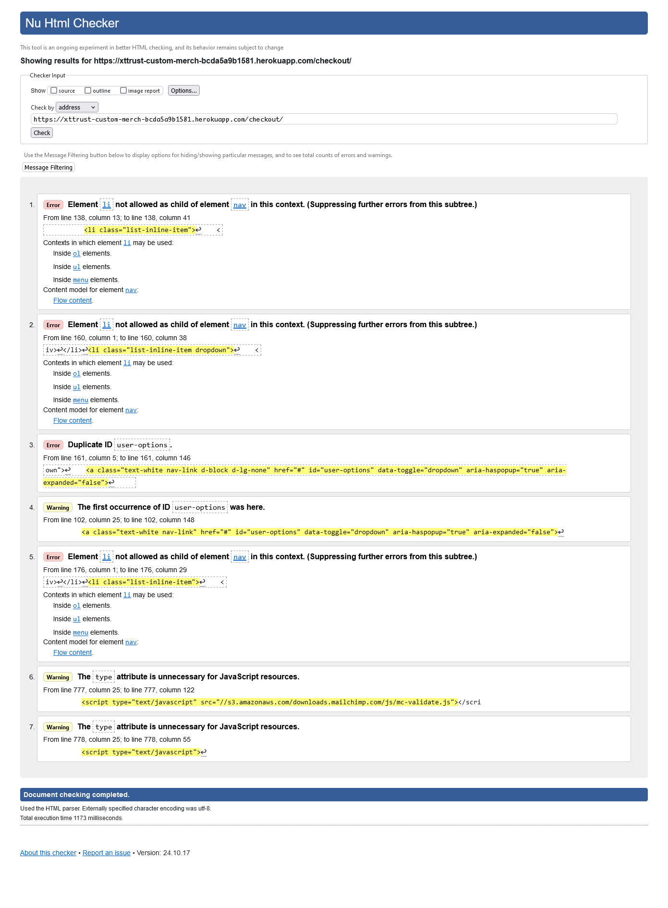

# Tests

## Lighthouse

Lighthouse is an open-source tool for improving the quality of web pages. It provides insights into performance, accessibility, best practices, and SEO. Below are the results from Lighthouse tests for various pages and devices.

### Home Page

Desktop

    

Mobile

    

### Shopping Bag Page

Desktop

    

Mobile

    

### Contact Page

Desktop

    

Mobile

    

### FAQs Page

Desktop

    

Mobile

    

### Products Listing Page

Desktop

    

Mobile

    

### Individual Product Page

Desktop

    

Mobile

    

## Code Validation

### HTML

### HTML Validation

The HTML validation process was conducted using the [Nu HTML Checker](https://validator.w3.org/). Below are the results for various pages on the website, highlighting any errors and warnings found.

Checkout Page Validation

    

Home Page Validation

    

Login Page Validation

    

Register Page Validation

    

Shopping Bag Page Validation

    

### Explanation of Errors

1. **Invalid `li` Elements Inside `nav` and Duplicate IDs**:  
   Several instances where `<li>` elements were placed directly inside `<nav>` elements instead of being wrapped in an unordered list (`<ul>`). This is because I folowed the Boutiq Ado walktru and keep 2 menus, one for desktop and one for mobile, both had the same ID.

### CSS

base.css

    

checkout.css

    

### Python

### PEP8 Validation

PEP8 validation was performed on all Python files in the project to ensure adherence to Python's style guide. Below are the results and highlights of each file:

Products Models

    

Products Views

    

Profiles Models

    

Profiles Views

    

Reviews Models

    

Reviews Views

    

Wishlist Models

    

Wishlist Views

    

Each issue identified primarily revolves around line length (E501). These issues can be resolved by breaking long lines into shorter ones or restructuring the code for clarity.

## Browser Testing

The Website was tested on Google Chrome, Firefox, Safari browsers with no issues noted.

## Device Testing

The website was tested on a variety of devices, including Desktop, and Samsung S21, to ensure that it displayed well on screens of different sizes, both in portrait and landscape orientations. The website functioned as expected, and its responsive design was validated using Chrome developer tools on various devices, ensuring that the layout remained structurally sound across different screen dimensions.

## Manual Testing

### Homepage

| Test Case                             | Steps                                                    | Expected Result                             | Status |
|---------------------------------------|----------------------------------------------------------|---------------------------------------------|--------|
| Verify Homepage Load                  | 1. Open the homepage URL. 2. Check page content.     | Homepage loads correctly with all sections displayed. | PASS    |
| Check Navigation Links                | 1. Click on each navigation link. 2. Verify redirection to corresponding pages. | Links redirect to the correct pages.       | PASS    |
| Test Responsive Design                | 1. Resize the browser window to various screen sizes. 2. Verify layout adapts appropriately. | Layout adjusts correctly for mobile, tablet, and desktop views. | PASS    |
| Verify Call-to-Action Buttons         | 1. Click each CTA button. 2. Ensure button redirects or performs the intended action. | Buttons perform actions as expected (e.g., redirect, open form). | PASS    |
| Test Search Functionality             | 1. Enter keywords in the search bar. 2. Press enter and verify results. | Results matching the search term are displayed correctly. | PASS    |

### Product Page

| Test Case                             | Steps                                                    | Expected Result                             | Status |
|---------------------------------------|----------------------------------------------------------|---------------------------------------------|--------|
| Verify Product Details Display        | 1. Navigate to a product page. 2. Check product information (image, price, description). | Product details are displayed accurately. | PASS    |
| Test Add to Bag Functionality        | 1. Click on "Add to Bag" button. 2. Check the Bag icon for update. | Product is added to the Bag successfully, and the Bag count increases. | PASS    |
| Validate Quantity Selection           | 1. Adjust product quantity using the selector. 2. Click "Add to Bag" and verify Bag reflects correct quantity. | Bag updates to reflect the selected quantity accurately. | PASS    |
| Test Responsive Design                | 1. Resize the browser window to mobile/tablet sizes. 2. Ensure product layout adjusts appropriately. | Product layout is responsive and displays correctly on different screen sizes. | PASS    |

### Bag Page

| Test Case                             | Steps                                                    | Expected Result                             | Status |
|---------------------------------------|----------------------------------------------------------|---------------------------------------------|--------|
| Verify Bag Page Load                 | 1. Navigate to the Bag page. 2. Check for product list and total price. | Bag displays all added products with correct details. | PASS    |
| Test Quantity Update                  | 1. Change the quantity of a product in the Bag. 2. Verify total price updates. | Bag updates correctly when quantity is changed. | PASS    |
| Remove Product from Bag              | 1. Click "Remove" on a product. 2. Check if product is removed from the Bag and total price adjusts. | Product is removed and Bag updates accurately. | PASS    |
| Test Checkout Button                  | 1. Click the "Proceed to Checkout" button. 2. Ensure user is redirected to the checkout page. | Checkout page opens after clicking the button. | PASS    |

### Checkout Page

| Test Case                             | Steps                                                    | Expected Result                             | Status |
|---------------------------------------|----------------------------------------------------------|---------------------------------------------|--------|
| Verify Form Validation                | 1. Leave fields empty and attempt to submit. 2. Observe validation messages. | Appropriate validation messages are displayed for empty fields. | PASS    |
| Test Payment Integration              | 1. Enter valid payment details. 2. Submit the form.   | Payment is processed and confirmation message is shown. | PASS    |
| Test Error Handling for Invalid Card  | 1. Enter invalid card details. 2. Attempt to submit.  | Error message is displayed, and payment is not processed. | PASS    |

### User Account

| Test Case                             | Steps                                                    | Expected Result                             | Status |
|---------------------------------------|----------------------------------------------------------|---------------------------------------------|--------|
| Test Registration Functionality       | 1. Navigate to the "Register" page. 2. Fill out form and submit. | User is registered successfully and redirected to the homepage or account page. | PASS    |
| Validate Login Process                | 1. Navigate to the "Login" page. 2. Enter credentials and submit. | User is logged in and redirected to their account page. | PASS    |
| Test Password Reset                   | 1. Click on "Forgot Password" link. 2. Enter email and follow instructions. | Password reset email is sent successfully. | PASS    |

### Wishlist Functionality

| Test Case                             | Steps                                                    | Expected Result                             | Status |
|---------------------------------------|----------------------------------------------------------|---------------------------------------------|--------|
| Add Product to Wishlist               | 1. Navigate to a product page. 2. Click "Add to Wishlist". | Product is added to the wishlist and confirmation is shown. | PASS    |
| Verify Wishlist Display               | 1. Navigate to the "Wishlist" page. 2. Check for added products. | Products added to the wishlist are displayed correctly. | PASS    |
| Remove Product from Wishlist          | 1. Click "Remove" on a product in the wishlist. 2. Confirm product is removed. | Product is removed from the wishlist successfully. | PASS    |

### Footer and Links

| Test Case                             | Steps                                                    | Expected Result                             | Status |
|---------------------------------------|----------------------------------------------------------|---------------------------------------------|--------|
| Verify Footer Display                 | 1. Scroll to the bottom of any page. 2. Ensure footer content is visible and correct. | Footer displays correctly with all links and information. | PASS    |
| Test Footer Links                     | 1. Click each footer link. 2. Ensure it redirects to the correct page. | Footer links work and direct to the appropriate pages. | PASS    |
| Test Newsletter                       | 1. Enter email address 2. Ensure mailchimp sents a confirmation message. | Confirmation message successfully. | PASS    |

### Contact Page

| Test Case                             | Steps                                                    | Expected Result                             | Status |
|---------------------------------------|----------------------------------------------------------|---------------------------------------------|--------|
| Verify Contact Form Display           | 1. Navigate to the contact page. 2. Ensure all form fields are visible. | Contact form displays correctly with all fields. | PASS    |
| Test Form Submission                  | 1. Fill out the contact form with valid information. 2. Click "Submit". | Form submits successfully, and a confirmation message is shown. | PASS    |
| Validate Form Error Handling          | 1. Leave fields empty or enter invalid information. 2. Attempt to submit the form. | Error messages display correctly, preventing form submission. | PASS    |

### FAQs Page

| Test Case                             | Steps                                                    | Expected Result                             | Status |
|---------------------------------------|----------------------------------------------------------|---------------------------------------------|--------|
| Verify FAQs Load                      | 1. Open the FAQs page URL. 2. Ensure all questions and answers are displayed. | FAQs are loaded and displayed correctly. | PASS    |
| Test Collapsible Functionality        | 1. Click on a question. 2. Verify if the answer expands/collapses as expected. | Clicking on a question expands and collapses the answer section correctly. | PASS    |
| Test Responsive Design                | 1. Resize the browser window to various screen sizes. 2. Ensure FAQs layout adjusts accordingly. | FAQs display correctly across all screen sizes. | PASS    |

### Reviews Section

| Test Case                             | Steps                                                    | Expected Result                             | Status |
|---------------------------------------|----------------------------------------------------------|---------------------------------------------|--------|
| Verify Reviews Display                | 1. Navigate to a product page with reviews. 2. Scroll to the reviews section. | Reviews are displayed correctly with user details and ratings. | PASS    |
| Test Adding a Review                  | 1. Navigate to a product page. 2. Click "Add Review". 3. Submit a review. | Review is submitted and appears in the list. | PASS    |
| Validate Review Submission Error Handling | 1. Attempt to submit a review without logging in. 2. Observe the error message. | User is prompted to log in before submitting a review. | PASS    |

